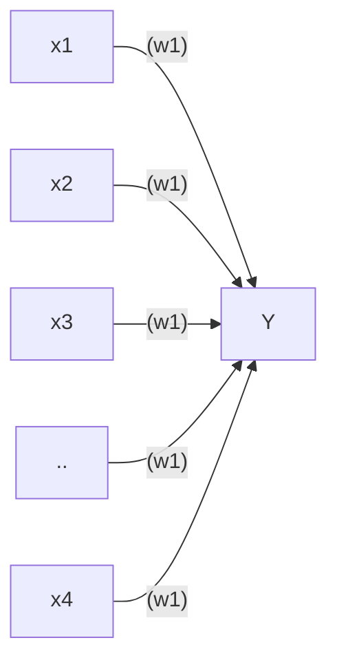
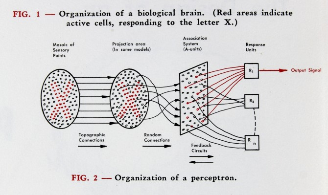

# Simple Perceptron implementation in Python

## Getting started
 * Dependencies
    * Python 3.10 or higher
    * poetry
 
 * Usage
    * Clone the repository
    * Run `poetry install` to install the dependencies
    * Run `poetry run jupyter notebook` to run the jupyter notebooks

## Overview
This is a Python implementation of the [Perceptron Algorithm](https://en.wikipedia.org/wiki/Perceptron).
A perceptron is a single neuron model that is used to classify input data into two classes.
It is the simplest form of an artificial neural network, originally proposed
by [Frank Rosenblatt](https://en.wikipedia.org/wiki/Frank_Rosenblatt) in
his seminal
paper ["The perceptron: a probabilistic model for information storage and organization in the brain." Rosenblatt F.(1958)](https://www.ling.upenn.edu/courses/cogs501/Rosenblatt1958.pdf)

## Overview

##### About the files

* `perceptron.py` : Simple small implementation of the  algorithm.
* `notebooks/perceptron_2d.ipynb` : A simple perceptron with 2 inputs trained on an 8x8 card - predicts whether 
* * `notebooks/perceptron_64.ipynb` : A simple perceptron with 64 inputs trained on an 8x8 card

## History of the Perceptron
There are
many [inventions that have shaped the field of artificial intelligence](https://www.mckinsey.com/featured-insights/artificial-intelligence/deep-learnings-origins-and-pioneers),
but one of the most important is the perceptron. The perceptron was invented in 1957 by Frank Rosenblatt, a psychologist
at the Cornell Aeronautical
Laboratory. The perceptron was the first neural network, and it was the first time that a computer could learn from its
own mistakes.

An image of the perceptron from Rosenblatt's “The Design of an Intelligent Automaton,” Summer 1958."

## Critcisms and Limitations
For most of the 1960s, the perceptron was seen as a major breakthrough in
artificial intelligence. However, in 1969, [Marvin Minsky](https://en.wikipedia.org/wiki/Marvin_Minsky)
(who was one year his junior at 
[Bronx Science](https://en.wikipedia.org/wiki/Bronx_High_School_of_Science)
)
and [Seymour Papert](https://en.wikipedia.org/wiki/Seymour_Papert)
published a book called ["Perceptrons"](https://en.wikipedia.org/wiki/Perceptrons_(book))
, which showed that the perceptron had
severe limitations. They showed that the perceptron could not learn simple
functions like the XOR function, which is a basic logical operation. This
result led to a decline in interest in neural networks, and the perceptron
was largely abandoned.

## Perceptron Evolution
However, in the 1980s, researchers discovered that by stacking multiple
perceptrons together, they could create a more powerful neural network
called a [multilayer perceptron](https://en.wikipedia.org/wiki/Multilayer_perceptron), a precursor 
to the more complex neural networks that are used today.

Although Rosenblatt was not able to see the full potential of the perceptron, and 
died in a boating accident in 1971, his belief in the potential of neural networks has been vindicated.

