# Simple Perceptron implementation in Python

## Getting started

* Dependencies
    * Python 3.10 or higher
    * poetry

* Usage
    * Clone the repository
    * Run `poetry install` to install the dependencies
    * Run `poetry run jupyter notebook` to run the jupyter notebooks

##### About the files

* `perceptron.py` : Simple small implementation of the algorithm.
* `notebooks/perceptron_2d.ipynb` : A simple perceptron with 2 inputs trained on an 8x8 card - learns a linear boundary
  in each card.
* `notebooks/perceptron_64.ipynb` : A simple perceptron with 64 inputs trained on an 8x8 card. Learns to predict whether
  the cards have vertical or horizontal boundaries.

## Overview

This is a Python implementation of the [Perceptron Algorithm](https://en.wikipedia.org/wiki/Perceptron).
A perceptron is a single neuron model that is used to classify input data into two classes.
It is the simplest form of an artificial neural network, originally proposed
by [Frank Rosenblatt](https://en.wikipedia.org/wiki/Frank_Rosenblatt) in
his seminal
paper ["The perceptron: a probabilistic model for information storage and organization in the brain." Rosenblatt F.(1958)](https://www.ling.upenn.edu/courses/cogs501/Rosenblatt1958.pdf)

## Pereceptron Algorithm


Fig: 01

Apply a set of weights to the input features and sum them up. If the sum is greater than a threshold, the perceptron
fires and outputs a 1, otherwise it outputs a -1.

## Pereceptron Algorithm Learning

Update the weights based on the error in the prediction. The weights are updated by adding the product of the error and
the input to the current weight.

$$
\text{if } y*a \leq 0 \text{ then }
\bigg|\begin{multline}
\begin{aligned}
w_i &= w_i + y x_i \text{ for i = 1,2,3,..,n} \\
b &= b + y
\end{aligned}
\end{multline}
$$

The key is that if there are no errors, the weights are not updated.
If there are errors, the weights are updated in the direction that reduces the error.

## Perceptron Convergence

However, as long as the data is linearly separable, the perceptron algorithm
is [guaranteed to converge to a solution.](https://www.cs.cornell.edu/courses/cs4780/2018fa/lectures/lecturenote03.html#:~:text=The%20Perceptron%20was%20arguably%20the,%2C%20it%20will%20loop%20forever.)
But, a major limitation of the perceptron is that it can <mark>only learn linearly separable functions.</mark>,
and non-linear functions are common and trivial to find.

e.g. [Minsky and Papert](https://books.google.com/books/about/Perceptrons_Reissue_of_the_1988_Expanded.html?id=PLQ5DwAAQBAJ)
showed that perceptrons could not learn simple functions like the XOR function


Furthermore, if the perceptron has N inputs, the decision boundary is an N-1 dimensional hyperplane. E.g. in a
2D space, the decision boundary is a line, in a 3D space, the decision boundary is a plane, and so on.

## History of the Perceptron

There are
many [inventions that have shaped the field of artificial intelligence](https://www.mckinsey.com/featured-insights/artificial-intelligence/deep-learnings-origins-and-pioneers),
but one of the most important is the perceptron. The perceptron was invented in 1957 by Frank Rosenblatt, a psychologist
at the Cornell Aeronautical
Laboratory. The perceptron was the first neural network, and it was the first time that a computer could learn from its
own mistakes.


An image of the perceptron from Rosenblatt's “The Design of an Intelligent Automaton,” Summer 1958."

## Critcisms and Limitations

For most of the 1960s, the perceptron was seen as a major breakthrough in
artificial intelligence. However, in 1969, [Marvin Minsky](https://en.wikipedia.org/wiki/Marvin_Minsky)
(who was one year his junior at
[Bronx Science](https://en.wikipedia.org/wiki/Bronx_High_School_of_Science)
)
and [Seymour Papert](https://en.wikipedia.org/wiki/Seymour_Papert)
published a book called ["Perceptrons"](https://en.wikipedia.org/wiki/Perceptrons_(book))
, which showed that the perceptron had
severe limitations. They showed that the perceptron could not learn simple
functions like the XOR function, which is a basic logical operation. This
result led to a decline in interest in neural networks, and the perceptron
was largely abandoned.

## Perceptron Evolution

However, in the 1980s, researchers discovered that by stacking multiple
perceptrons together, they could create a more powerful neural network
called a [multilayer perceptron](https://en.wikipedia.org/wiki/Multilayer_perceptron), a precursor
to the more complex neural networks that are used today.

Although Rosenblatt was not able to see the full potential of the perceptron, and
died in a boating accident in 1971, his belief in the potential of neural networks has been vindicated.

## References

1. Hal Daumé III, "A Course in Machine Learning" [PDF](http://ciml.info/dl/v0_99/ciml-v0_99-ch04.pdf)
2. Deep Learning's Origins and Pioneers,
   McKinsey [Link](https://www.mckinsey.com/featured-insights/artificial-intelligence/deep-learnings-origins-and-pioneers)
3. Professors: Perceptron paved the way for AI, 60 years too soon, Cornell
   University [Link](https://news.cornell.edu/stories/2019/09/professors-perceptron-paved-way-ai-60-years-too-soon)
4. The Perceptron: A Probabilistic Model for Information Storage and Organization in the Brain, Frank
   Rosenblatt [PDF](https://www.ling.upenn.edu/courses/cogs501/Rosenblatt1958.pdf)
5. Perceptrons Minsky, Marvin; Papert,
   Seymour [Link](https://books.google.com/books/about/Perceptrons_Reissue_of_the_1988_Expanded.html?id=PLQ5DwAAQBAJ)

## Resources

#### Training results for 2 input perceptron


#### Training results for 64 input perceptron


#### Mermaid flowchart for Fig 01

``` 
   flowchart LR
    subgraph Inputs["Inputs"]
        A1["$$ x_1$$"]
        A2["$$ x_2$$"]
        ADOT[".."]
        AN["$$ x_n$$"]
    end
    subgraph subGraph1["Weights"]
        w1(("$$ w_1 $$"))
        w2(("$$ w_2 $$"))
        wDOT[".."]
        wN(("$$ w_n $$"))
    end
    C{"$$ z = \sum_{i=1}^n x_i w_i + b $$"}
    step["$$ output = \begin{cases}1 & \text{if }\ z > T \text{,\ where T is some threshold},\\-1 & \text{otherwise}\end{cases} $$"]
    output["$$y$$"]
    %% Comments after double percent signs

    A1 --> w1 
    w1--> C
    A2 --> w2
    w2 --> C
    ADOT --> wDOT
    wDOT --> C
    AN --> wN
    wN --> C
    C --> step
    step --> output
    style C stroke-width:2px
```
